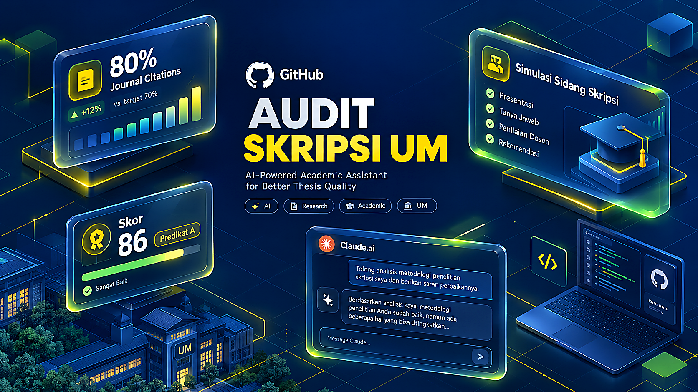

<div align="center">


<br><br>

# 🎓 Audit Skripsi UM — AI Companion & Simulasi Sidang Skripsi

**Sistem Audit Akademik Cerdas, Bimbingan Rekonstruksi Kalimat, dan Simulasi Sidang Dosen "Killer" Berstandar Pedoman Penulisan Karya Ilmiah Universitas Negeri Malang (UM) 2017 (Edisi Keenam)**

[](LICENSE)
[](https://audit-skripsi-um.webenzelabs.id)
[](https://www.python.org/)
[-orange.svg)](Pedoman-Penulisan-Karya-Ilmiah-2017.md)
[](#-3-jalur-akses-mahasiswa)

[🌐 Buka Website](https://audit-skripsi-um.webenzelabs.id) • [Panduan Cepat](#-3-jalur-akses-mahasiswa) • [Fitur Utama](#-fitur-unggulan) • [Perintah Cepat](#-daftar-perintah-interaktif) • [Toolkit Otomasi Python](#-toolkit-otomasi-python-offline) • [Kontribusi](CONTRIBUTING.md)

</div>

---

## 📌 Mengapa Repositori Ini Dibuat?

Banyak mahasiswa tingkat akhir mengalami revisi berulang kali atau kesulitan saat ujian sidang skripsi karena:
1. **Benang Merah Putus:** Rumusan masalah tidak terjawab oleh metode, kajian teori tidak mendukung variabel, dan simpulan mengulang teori.
2. **Kajian Pustaka Usang & Sekunder:** Rujukan terbit lebih dari 10 tahun lalu dan mengandalkan buku teks tanpa artikel jurnal ilmiah (melanggar syarat minimal 80% jurnal & 80% mutakhir).
3. **Pembahasan Tidak Ilmiah:** Bab pembahasan hanya mendeskripsikan ulang tabel angka tanpa memaknai *mengapa* hasilnya demikian dan tanpa konfirmasi teori.
4. **Kecerobohan Bahasa:** Penggunaan kata non-baku (*aktifitas, merubah*), konjungsi terlarang di awal kalimat (*Sehingga, Sedangkan*), dan frasa subjektif (*"peneliti melakukan"*).

Repositori ini hadir sebagai **sarana belajar mandiri** untuk membantu mahasiswa mendeteksi kelemahan naskah sejak dini, merekonstruksi kalimat ilmiah secara terstandar, dan melatih mental menjawab pertanyaan dosen penguji sebelum maju ke ruang sidang yang sesungguhnya.

### 🗺️ Infografis Alur Penelaahan & Simulasi Sidang

<p align="center">
  <a href="assets/img/infografis-alur-kerja.png" target="_blank">
    
  </a>
</p>

---

## ⚡ 3 Jalur Akses Mahasiswa

Pilih cara yang paling mudah sesuai kenyamanan Anda:

```
                  ┌──────────────────────────────────────────────┐
                  │          PILIHAN CARA PENGGUNAAN             │
                  └──────────────────────┬───────────────────────┘
                                         │
         ┌───────────────────────────────┼───────────────────────────────┐
         ▼                               ▼                               ▼
  🌐 JALUR A (WEB)               🤖 JALUR B (AGENT)              💻 JALUR C (CLI)
  Claude.ai Projects             Antigravity / Claude Code        Terminal Offline
  (Tanpa Koding/Install)         (Auto-Install 1-Klik)            (Python Tanpa Install)
```

---

### 🌐 Jalur A: Claude.ai Projects (Web — Paling Mudah)
*Cocok untuk mahasiswa yang ingin langsung copy-paste di browser tanpa menginstall software.*

1. Buka [claude.ai](https://claude.ai) dan pilih menu **Projects** ➔ **Create Project**.
2. Beri nama: `Audit Skripsi UM`.
3. Buka **Project Settings** ➔ **Set custom instructions**:
   - Buka file [`CLAUDE_PROJECT_INSTRUCTIONS.md`](CLAUDE_PROJECT_INSTRUCTIONS.md) di repo ini.
   - Salin seluruh isinya dan paste ke kolom Custom Instructions.
4. Buka **Project Knowledge** ➔ **Upload file**:
   - Upload file [`Pedoman-Penulisan-Karya-Ilmiah-2017.md`](Pedoman-Penulisan-Karya-Ilmiah-2017.md).
5. Buka chat baru, lalu ketik `/audit`, `/sidang`, atau `/bimbingan`!

---

### 🤖 Jalur B: Antigravity IDE & Claude Code (AI Agent)
*Cocok untuk pengguna IDE AI modern dengan skill otomatis.*

1. Clone repositori ini ke komputer Anda:
   ```bash
   git clone https://github.com/nandaaddi/audit-skripsi-um.git
   cd audit-skripsi-um
   ```
2. Jalankan script instalasi otomatis:
   - **Windows (PowerShell):**
     ```powershell
     powershell -ExecutionPolicy Bypass -File install.ps1
     ```
   - **Linux / macOS (Bash):**
     ```bash
     chmod +x install.sh && ./install.sh
     ```
3. Skill `audit-skripsi` akan otomatis terpasang di runtime agent Anda (`~/.agents/skills/` dan `~/.claude/skills/`).

---

### 💻 Jalur C: CLI Python Mandiri (Offline & Cepat)
*Dapat dijalankan langsung di terminal tanpa koneksi internet dan tanpa dependensi pihak ketiga (menggunakan library bawaan Python).*

Jalankan audit teknis terpadu pada berkas draf naskah Anda (`.docx`, `.md`, atau `.txt`):
```bash
python skills/audit-skripsi/scripts/audit_cli.py "path/ke/naskah.docx" --stage skripsi --level s1
```

---

## 🌟 Fitur Unggulan

### 1. Persona Ganda: Dosen Killer vs Bimbingan Konstruktif
- 🔴 **Mode Sidang Killer (`/sidang`):** Memerankan dosen penguji senior UM (*Prof. Dr. Evaluator, M.Pd.*). Menguji benang merah secara dingin, menyerang cacat logika per ronde, dan menerbitkan **Kartu Nilai Sidang resmi UM** di akhir ujian.
- 🟢 **Mode Bimbingan Edukatif (`/bimbingan`):** Memerankan dosen pembimbing (*Dr. Pembimbing Solutif, M.Pd.*). Menyajikan perbaikan kalimat ramah dengan **Formula 4-Bagian Rekonstruksi Ilmiah**.

<p align="center">
  <a href="assets/img/fitur-simulasi-sidang.png" target="_blank">
    
  </a>
</p>

### 2. Deteksi Otomatis 3 Dimensi Naskah &amp; Rasio Rujukan 80%
- **Jenis Penelitian:** Kuantitatif, Kualitatif, R&D, atau PTK.
- **Tahapan Naskah:** Proposal Skripsi (Bab 1–3), Naskah Lengkap Skripsi (Bab 1–5/6 + Lampiran), atau Ringkasan Artikel Jurnal UM.
- **Jenjang Studi:** Sarjana S1 (maks 15.000 kata), Magister S2 (maks 20.000 kata), atau Doktor S3 (maks 30.000 kata).

<p align="center">
  <a href="assets/img/fitur-audit-benang-merah.png" target="_blank">
    
  </a>
</p>

### 3. Formula 4-Bagian Rekonstruksi Kalimat Ilmiah
Setiap kritik naskah tidak sekadar memberi komentar umum, melainkan diformulasikan ke dalam 4 bagian:
```markdown
1. 📝 [Kutipan Kalimat Teks Asli Mahasiswa]
   ❌ Cacat Logika / Kaidah : [Penjelasan kaidah akademik yang dilanggar]
   📐 Formula Rekonstruksi  : [Rumus logika penyusunan kalimat ilmiah]
   ✏️ Contoh Perbaikan      : "[Draf kalimat siap pakai yang telah direvisi]"
```

### 4. Skala Penilaian Sidang & Scorecard Resmi UM
Mengadopsi sistem nilai mutu Universitas Negeri Malang:
- **A (85–100)** / **A- (80–84)** / **B+ (75–79)** / **B (70–74)** / **B- (65–69)** / **C+ (60–64)** / **C (55–59)** / **D (40–54)** / **E (<40)**.
- *Passing grade kelulusan S1:* Nilai minimal **B (70,00)**.

---

## 💬 Daftar Perintah Interaktif

Gunakan kata kunci perintah berikut di dalam sesi chat Anda:

| Perintah | Fungsi Utama | Contoh Input |
|---|---|---|
| `/audit` | **Audit Dokumen Menyeluruh** | `/audit` + paste teks bab skripsi |
| `/sidang` | **Simulasi Sidang Killer 4 Ronde** | `/sidang` + judul & ringkasan metode |
| `/bimbingan` | **Asistensi Perbaikan Ramah** | `/bimbingan` + paragraf yang ingin diperbaiki |
| `/benang-merah` | **Uji Keselarasan 5 Pilar** | Masalah ↔ Teori ↔ Metode ↔ Temuan ↔ Simpulan |
| `/cek-rujukan` | **Audit Rujukan 10 Tahun & Primer** | `/cek-rujukan` + daftar pustaka |
| `/cek-pedoman` | **Validasi Format Fisik UM** | Format sitasi nama-tahun, tabel/gambar, kuantitas kata |

---

## 🛠️ Toolkit Otomasi Python (Offline)

Toolkit ini berada di dalam folder [`skills/audit-skripsi/scripts/`](skills/audit-skripsi/scripts/):

```bash
# 1. Audit Diagnostik Terpadu (CLI Utama)
python skills/audit-skripsi/scripts/audit_cli.py examples/contoh_bab1_kuantitatif.md --stage skripsi --level s1

# 2. Output Data JSON (Untuk Integrasi Sistem)
python skills/audit-skripsi/scripts/audit_cli.py examples/contoh_bab1_kuantitatif.md --json

# 3. Audit Khusus Daftar Rujukan & Sitasi Silang
python skills/audit-skripsi/scripts/audit_rujukan.py examples/contoh_daftar_rujukan.md

# 4. Audit Kata Baku & Konjungsi Terlarang
python skills/audit-skripsi/scripts/audit_bahasa.py examples/contoh_bab1_kuantitatif.md

# 5. Konversi Naskah Word (.docx) ke Markdown Bersih
python skills/audit-skripsi/scripts/extract_naskah.py "naskah.docx" "output.md"
```

### Cuplikan Output CLI:
```text
=================================================================
📋 HASIL DIAGNOSTIK OTOMATIS: contoh_bab1_kuantitatif.md
🎓 Jenjang: S1 | Tahap: SKRIPSI
⚖️ Skor Kelayakan Teknis: 81.2/100 ➔ [LAYAK TEKNIS]
=================================================================

### 1. Metrik Kepatuhan Rujukan (UM 2017)
- Total Rujukan Terdaftar: 8 entri
- Kemutakhiran (10 Th Terakhir): 7/8 (87.5%) ✅
- Keprimeran (Jurnal/Riset): 6/8 (75.0%) ❌ Target: ≥80%
- Sitasi dalam Teks: 3 sitasi

### 2. Metrik Kepatuhan Bahasa & Format
- Panjang Kata Inti: 384 kata (Batas: 15,000 kata) ✅
- Kata Non-Baku Terdeteksi: 0 kasus ✅
- Konjungsi Awal Kalimat: 1 kasus ❌ (Sehingga di awal kalimat)
- Frasa Subjektif Persona: 1 kasus ❌ ("Peneliti melakukan")
- Desimal Tanda Titik (.): 2 angka ❌ (wajib koma `,` dalam bahasa Indonesia)
=================================================================
```

---

## 📁 Struktur Repositori

```text
audit-skripsi-um/
├── .gitignore                          # Proteksi berkas privat & cache
├── LICENSE                             # Lisensi terbuka MIT
├── README.md                           # Dokumentasi utama proyek
├── CONTRIBUTING.md                     # Panduan kontribusi komunitas
├── install.ps1                         # Installer 1-klik Windows PowerShell
├── install.sh                          # Installer 1-klik Linux/macOS
├── CLAUDE_PROJECT_INSTRUCTIONS.md      # Custom Instructions untuk Claude.ai Projects
├── PANDUAN_PEMAKAIAN.md                # Panduan pemakaian detail pengguna
├── Pedoman-Penulisan-Karya-Ilmiah-2017.md # Buku Pedoman UM 2017 Lengkap (147 KB)
├── examples/                           # Berkas contoh publik untuk pengujian
│   ├── contoh_bab1_kuantitatif.md
│   └── contoh_daftar_rujukan.md
└── skills/
    └── audit-skripsi/                  # Modul utama Skill
        ├── SKILL.md                    # Prompt sistem, persona, dan alur sidang
        ├── reference/                  # 4 Modul acuan standar UM
        │   ├── rubrik-audit-um2017.md
        │   ├── skala-penilaian-sidang-um.md
        │   ├── panduan-artikel-jurnal-um.md
        │   └── kamus-tata-bahasa-ilmiah.md
        └── scripts/                    # 4 Script Python mandiri tanpa dependensi
            ├── audit_cli.py
            ├── audit_rujukan.py
            ├── audit_bahasa.py
            └── extract_naskah.py
```

---

## ⚖️ Penafian Akademik (Academic Disclaimer)

> [!IMPORTANT]
> **PENAFIAN PENTING:**
> 1. Proyek ini adalah inisiatif independen berbasis sumber terbuka (*open source*) yang dikembangkan untuk tujuan edukasi dan asistensi belajar mandiri bagi mahasiswa.
> 2. Proyek ini **tidak berafiliasi secara institusional resmi** dengan pimpinan atau senat Universitas Negeri Malang. Standar penulisan disarikan secara objektif dari dokumen publik *Pedoman Penulisan Karya Ilmiah Universitas Negeri Malang Edisi Keenam Tahun 2017*.
> 3. Hasil audit dan skor simulasi AI merupakan perkiraan analitis dan **tidak menggantikan otoritas, keputusan, atau penilaian resmi dari Dosen Pembimbing dan Dewan Penguji Ujian Sidang Skripsi yang sah**.
> 4. Pengguna bertanggung jawab penuh atas integritas akademik, keaslian data penelitian, dan orisinalitas naskah karya ilmiah masing-masing.

---

## 📄 Lisensi

Didistribusikan di bawah lisensi terbuka **MIT License**. Silakan gunakan, pelajari, kembangkan, dan bagikan untuk kemajuan dunia akademik. Lihat berkas [LICENSE](LICENSE) untuk ketentuan lengkap.
